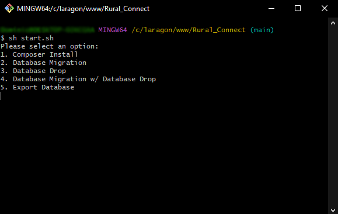
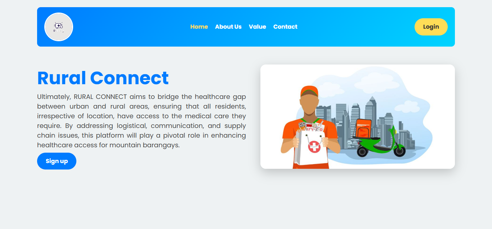

# 

### BRIDGE THE GAP BETWEEN CITY HEALTH PROVIDERS AND RURAL BARANGAY

## DESCRIPTION

Rural Connect is a student-led initiative from the University of Cebu – Main Campus, dedicated to improving healthcare accessibility in barangays. By optimizing logistics, the project ensures efficient delivery of essential medicines and supplies from CityHealth to local communities. Through technology and innovation, Rural Connect aims to reduce delays, support local health units, and create a healthier, more connected society.

## INSTRUCTION

- **Project Setup and Database Management**

- **Before starting the project:**

  - If you just cloned or pulled from the repository, open Git Bash and enter `sh start.sh` to display the options.
  - If you haven't installed the Composer dependencies yet, select option 1 to install the required libraries.
  - If you haven't migrated the database yet, select option 2 for database migration.
  - If you want to drop the existing database, select option 3 for database drop.
  - If there are updates in the database schema and you want to drop the existing database and migrate, select option 4.
  - If you want to export the current database to an SQL file, select option 5.

  **NOTE:** Before migrating the database, dropping it, or exporting it, make sure you start your XAMPP server.

## RURAL CONNECT LANDING PAGE

